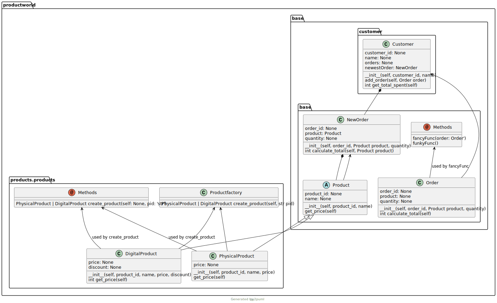

# Py2puml mod with methods

This a mod that explores possibilities to analyze python code
The fork is not compatible with the current main branch of `Py2puml`.
More details for my motivation for this mod can be found on my
[blog](http://www.storymelange.com/posts/projects/uml-analyser/do-you-know-the-hidden-paths-of-your-code.html).

This repository is an explorative work to test if there is a performant way analyse and visualize a code base.

It uses the add-methods branch with some modifications:: https://github.com/lucsorel/py2puml/pull/43.
The PR of this branch was not merged, when I did this study.

The modifications are necessary to correctly connect usage of classes in functions:
Two passes are done as can be seen in `inspectpackage.py`.

```
inspect_module(domain_item_module: ModuleType, root_module_name: str, domain_items_by_fqn: Dict[str, UmlItem],
                   domain_relations: List[UmlRelation],modules_by_name: Dict[str, UmlModule], firstPass=True)
```

## Usage
Run as module

Working directory must be module path.

Parameters: 
- module path is the path to the directory of the module directory.
- module name is the module name

## Example
A bigger example was added to evaluate the documentation of methods and dependencies in class methods.

With working directory `example/productworld`, run `python -m py2puml productworld productworld`.

The result shows the correct documentation of methods and free functions.

